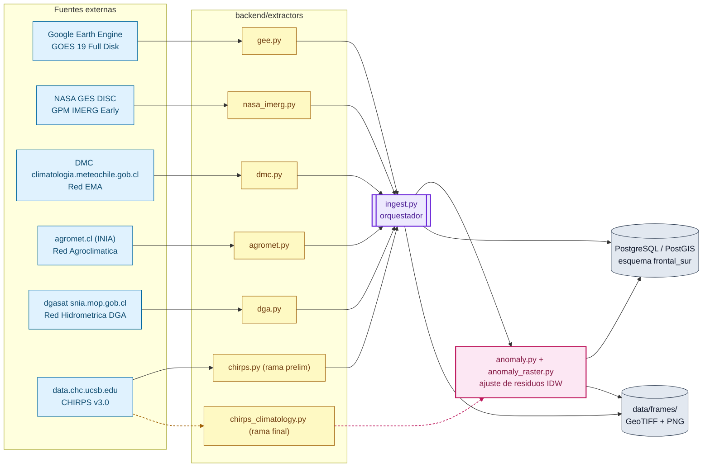
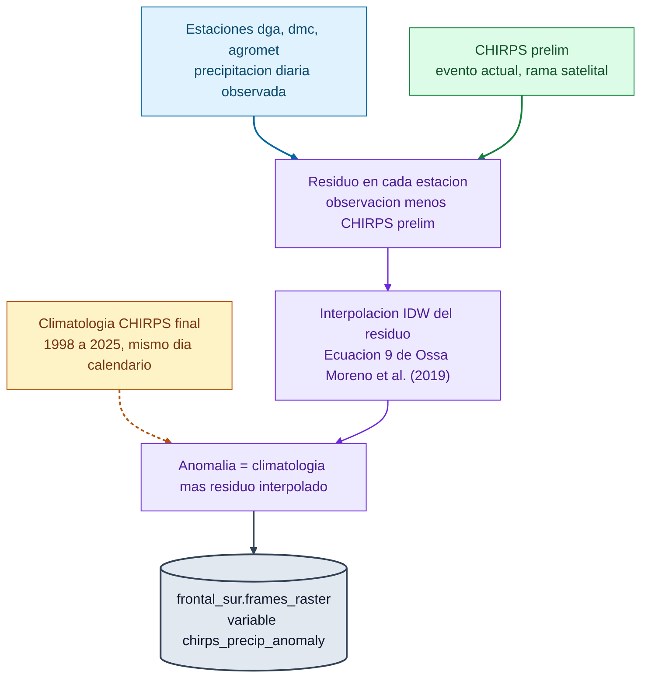

# Backend sistema_frontal_chile

Pipeline de ingesta, almacenamiento y calculo de anomalias climaticas para el monitoreo de la anomalia de precipitacion en curso sobre el bbox Coquimbo a Magallanes, mas todos los espacios marinos hasta el limite oeste del Mar Presencial.


## Tabla de contenidos

1. [Arquitectura general](#arquitectura-general)
2. [Stack tecnologico](#stack-tecnologico)
3. [Instalacion](#instalacion)
4. [Migraciones](#migraciones)
5. [Rol de base de datos acotado](#rol-de-base-de-datos-acotado)
6. [Catalogos de estaciones](#catalogos-de-estaciones)
7. [Orquestador de ingesta](#orquestador-de-ingesta)
8. [Fuentes activas](#fuentes-activas)
9. [Anomalia climatica: ajuste de residuos IDW](#anomalia-climatica-ajuste-de-residuos-idw)
10. [Esquema de base de datos](#esquema-de-base-de-datos)
11. [Estructura del proyecto](#estructura-del-proyecto)
12. [Monitoreo continuo (cron)](#monitoreo-continuo-cron)
13. [Tests](#tests)
14. [Referencias](#referencias)

## Arquitectura general

Cada fuente externa tiene un extractor propio en `backend/extractors/`, todos con la misma firma `fetch(start, end, bbox)` o `fetch_batches(start, end, bbox, engine)`. El orquestador `backend/ingest.py` los corre en secuencia dentro de un unico tunel SSH, upsertea el resultado con `ON CONFLICT` (el pipeline es idempotente: correrlo dos veces sobre la misma ventana no duplica nada) y registra exito o falla de cada fuente en `frontal_sur.ingest_runs`, sin que la falla de una fuente detenga a las demas.



Las flechas solidas siguen el camino principal del evento actual (fuente, extractor, orquestador). Las flechas punteadas marcan el camino aparte de la climatologia historica (`chirps_climatology.py`), que solo alimenta el calculo de anomalia, nunca el orquestador directo.

Politica de fuentes: se prioriza la API directa del emisor original del dato antes que un intermediario. IMERG ya migro de Google Earth Engine a NASA GES DISC; GOES queda en GEE como excepcion temporal (migrar al bucket publico de AWS de NOAA exige reproyectar desde la proyeccion geoestacionaria, todavia pendiente). ClimateSERV se evaluo y se descarto: solo publica CHIRPS v2 y su IMERG devuelve vacio (verificado en vivo el 17 de julio de 2026).

## Stack tecnologico

| Componente | Uso en este proyecto |
|---|---|
| Python 3.12 | Todo el pipeline, sin frameworks web ni ORM |
| PostgreSQL + PostGIS | Esquema `frontal_sur`, geometrias, indices GIST |
| SQLAlchemy (Core, sin ORM) | Conexion y `text()` para SQL explicito |
| psycopg2 | Driver de PostgreSQL |
| sshtunnel + paramiko | Tunel SSH hacia la base de datos remota compartida |
| rasterio + GDAL | Lectura, recorte y escritura de GeoTIFF |
| NumPy | IDW vectorizado del ajuste de residuos |
| pandas + geopandas + shapely | Manejo tabular y geometrico auxiliar |
| requests (con retry/backoff propio) | Llamadas HTTP a DGA, DMC, Agromet, CHC |
| earthengine api + geemap | Extractor GOES via Google Earth Engine |
| earthaccess | Autenticacion NASA Earthdata para GES DISC |
| Pillow | Overlays PNG de los rasters |
| python dotenv (`dotenv_values`) | Configuracion desde `.env`, nunca variables de entorno globales del proceso |

## Instalacion

```bash
python3 -m venv .venv
.venv/bin/pip install -r requirements.txt
cp backend/.env.example backend/.env
# completar backend/.env con las credenciales reales
```

Autenticar Earth Engine una sola vez (queda cacheado localmente):

```bash
.venv/bin/earthengine authenticate
```

## Migraciones

Runner minimo sin framework tipo Alembic: los archivos `.sql` numerados en `backend/migrations/` se aplican en orden por nombre y quedan registrados en `frontal_sur.schema_migrations`. Correrlo dos veces sin cambios nuevos no hace nada la segunda vez.

```bash
.venv/bin/python backend/management/migrate.py
```

## Rol de base de datos acotado

`frontal_sur_app` es el rol que usa el pipeline automatizado en produccion, en vez del superusuario que se reserva para migraciones manuales. Solo puede leer y escribir en el esquema `frontal_sur`, mas hacer `SELECT` sobre las tablas de limites administrativos (`dpa_limites`) que necesitan los joins de comuna y el poligono del espacio marino de Chile.

```bash
.venv/bin/python backend/management/create_role.py '<password-generado>'
# agregar DB_APP_USER=frontal_sur_app y DB_APP_PASSWORD=<password> a backend/.env
```

## Catalogos de estaciones

Cada red de estaciones (DGA, DMC, Agromet) tiene un par de scripts: uno en `backend/management/` que puebla el catalogo (geometria, metadatos, comuna asignada por `ST_Contains`) y uno en `backend/extractors/` que lee ese catalogo para saber que estaciones consultar. Correr una vez al inicio y de nuevo solo cuando la red cambie, porque el upsert por codigo de estacion es idempotente.

```bash
# DGA: 4349 estaciones desde el seed backend/seeds/dga_estaciones.csv
.venv/bin/python backend/management/dga_stations.py

# DMC: red EMA completa desde getEstacionesRedEma
.venv/bin/python backend/management/dmc_stations.py

# Agromet: 417 estaciones desde el seed backend/seeds/agromet_estaciones.csv
.venv/bin/python backend/management/agromet_stations.py
```

## Orquestador de ingesta

```bash
# corrida normal, ventana de 7 dias hacia atras desde ahora
.venv/bin/python backend/ingest.py --days 7

# extraccion por fechas definidas (backfill puntual)
.venv/bin/python backend/ingest.py --start 2026-06-01 --end 2026-06-15

# valida un extractor nuevo sin escribir a la base de datos
.venv/bin/python backend/ingest.py --days 1 --dry-run

# corre solo una fuente puntual
.venv/bin/python backend/ingest.py --start 2026-07-10 --end 2026-07-18 --sources chirps_anomaly

# retoma una fuente por estacion cortada a mitad de corrida
.venv/bin/python backend/ingest.py --start 2026-07-11 --end 2026-07-19 --sources dga --resume-after 05111002-1 --workers 4

# reporte de solo lectura: hasta que fecha hay datos por fuente, sin ingestar nada
.venv/bin/python backend/ingest.py --status
```

`--resume-after` aplica a las fuentes que scrapean estacion por estacion (`dga`, `dmc`, `agromet`), las unicas que demostraron cortarse a mitad de corrida por caidas del tunel SSH o de internet. `--workers` (entre 1 y 4) solo aplica a `dga`: verificado en vivo que 4 sesiones concurrentes contra dgasat corren limpias, pero 10 hacen que el portal devuelva error 500 en el cien por ciento de los casos.

## Fuentes activas

| Fuente | Destino | Latencia tipica | Nota |
|---|---|---|---|
| `gee_goes` | `frames_raster` + GeoTIFF/PNG en `data/frames/gee/` | 30 minutos aprox | GOES 19 Full Disk, 1 frame por hora, recortado al bbox |
| `nasa_imerg` | `frames_raster` + `data/frames/nasa_imerg/` | 1 dia (diario), 4 horas (30 minutos) | Autenticacion Earthdata, el archivo global se borra tras recortar |
| `imerg_choropleth` | `choropleth_stats` | 1 dia aprox | Ventanas fijas de 24 horas, 72 horas y 7 dias por comuna |
| `dmc` | `dmc_datos` (tablon ancho, FK `ema_id` hacia `dmc_stations.id`) | minutos | 25 variables como columnas, upsert por estacion |
| `agromet` | `agromet_datos` (mismo patron que dmc, FK `ema_id`) | minutos | Red Agroclimatica Nacional, mismo diccionario unificado |
| `dga` | `dga_datos` (tablon ancho, FK `estacion_id` hacia `dga_stations.id`) | minutos a horas | Scraping estacion por estacion, soporta hasta 4 workers concurrentes |
| `chirps` | `frames_raster` + `data/frames/chirps/` | 6 a 7 dias | Rama `prelim/sat`, recorte por rango HTTP, sin bajar el GeoTIFF global |
| `chirps_anomaly` | `frames_raster` (variable `chirps_precip_anomaly`) | depende de estaciones y de chirps | Ajuste de residuos IDW, ver seccion siguiente |

Almacenamiento: todos los rasters viven en disco (`data/frames/`) y se serviran con un tiler u overlays PNG; la base de datos solo guarda metadatos (`frames_raster`) y vectores. Toda columna de geometria se llama `geometria` (o `geometria_<rol>`) y va al final de la tabla. El bbox del proyecto (`REGION_BBOX` en `ingest.py`) es la unica fuente de verdad geografica.

Fuera del pipeline por ahora: NOAA NCEI (retirado el 17 de julio de 2026 porque GHCND publica Chile con casi un anio de retraso, incompatible con monitoreo casi en tiempo real), Google Flood Hub (en espera de aprobacion de Google), MSWEP (requiere registro en GloH2O), CHIRPS v3 final para el evento actual (el CHC lo publica con meses de retraso, se usa solo como climatologia historica).

## Anomalia climatica: ajuste de residuos IDW

La anomalia de precipitacion se calcula ajustando por residuos un producto de fondo grillado, en vez de una regresion completa con covariables de terreno. La evidencia bibliografica (ver [Referencias](#referencias)) muestra que con redes de estaciones ralas, como la disponible en este bbox, ese metodo simple rinde mejor que una regresion con covariables.



Cada color de nodo marca su rol en la formula (Eq. 9): azul para la observacion de estacion, verde para el fondo del evento actual (CHIRPS prelim), naranja punteado para la climatologia historica (el unico insumo que no depende de la ventana del evento), morado para los pasos de calculo, y gris oscuro para la salida final en la base de datos.

Detalle del metodo:

1. Se toma la observacion diaria de cada estacion con dato ese dia (suma para dga y agromet, maximo del acumulado de 24 horas para dmc).
2. Se calcula el residuo entre esa observacion y CHIRPS prelim (rama `prelim/sat`) en la ubicacion exacta de la estacion.
3. Ese residuo se interpola con IDW (Inverse Distance Weighting, potencia 1) a cada pixel de la grilla del bbox.
4. La superficie interpolada de residuos se suma de vuelta al valor de la climatologia CHIRPS historica (rama `final/sat`, promedio del mismo dia calendario a lo largo de 1998 a 2025, minimo exigido por la guia de la OMM de 10 anios consecutivos para un promedio de periodo defendible).

Un dia se omite automaticamente si falta cualquiera de sus tres insumos (estaciones, CHIRPS prelim o climatologia); no es un error del pipeline, es la corrida siguiente la que recoge ese dia cuando el dato ya exista. La primera vez que se pide un dia calendario nuevo, la climatologia se descarga y se cachea en disco (hasta 28 anios, recortados por rango HTTP, nunca el archivo global), asi que puede tardar bastante; una corrida interrumpida retoma sola porque lo ya descargado no se vuelve a pedir.

## Esquema de base de datos

Esquema `frontal_sur`, cuatro migraciones (`backend/migrations/0001` a `0004`):

* `ingest_runs`: bitacora de cada corrida por fuente (inicio, fin, estado, error).
* `frames_raster`: metadatos de cada raster (GOES, IMERG, CHIRPS, anomalia), `UNIQUE (source, variable, region, valid_time)`, geometria generada del bbox.
* `choropleth_stats`: acumulados de precipitacion por comuna, FK hacia `dpa_limites.dpa_comuna_subdere`.
* `dmc_stations` / `dmc_datos`: catalogo EMA y tablon ancho de datos horarios.
* `agromet_stations` / `agromet_datos`: catalogo Agromet y tablon ancho.
* `dga_stations` / `dga_datos`: catalogo de la Red Hidrometrica (4349 estaciones) y tablon ancho de parametros instantaneos (caudal, niveles, variables atmosfericas, nieve).
* `schema_migrations`: control de que migraciones ya se aplicaron.

## Estructura del proyecto

```
backend/
├── ingest.py              orquestador principal
├── db.py                  conexion, tunel SSH, helpers de upsert
├── anomaly.py             matematica pura del ajuste de residuos IDW
├── logutil.py             logging compartido con timestamp
├── extractors/            un modulo por fuente externa
├── management/            scripts de un solo uso u ocasionales
│   ├── migrate.py
│   ├── create_role.py
│   ├── dga_stations.py
│   ├── dmc_stations.py
│   └── agromet_stations.py
├── migrations/            SQL numerado, aplicado por migrate.py
├── seeds/                 catalogos base en CSV
└── tests/                 tests planos con assert, sin pytest
```

## Monitoreo continuo (cron)

Sin scheduler ni cola de tareas: una entrada de crontab basta, porque el pipeline es idempotente (upsert con `ON CONFLICT`, y los rasters ya descargados no se vuelven a bajar). Editar con `crontab -e`:

```cron
0 */6 * * * cd /ruta/al/proyecto && .venv/bin/python backend/ingest.py --days 2 >> /var/log/frontal_sur_ingest.log 2>&1
```

Corre cada 6 horas con ventana de 2 dias: el solape extra es barato gracias a la idempotencia. CHIRPS (con 6 a 7 dias de latencia) y el diario de IMERG (con un dia de latencia) se recogen solos a medida que se publican, sin ventana especial. El log es verboso: una linea con timestamp por cada descarga, granulo, lote de estacion y fuente completada.

## Tests

Sin pytest: cada archivo en `backend/tests/` corre con `assert` plano.

```bash
.venv/bin/python backend/tests/test_db.py
.venv/bin/python backend/tests/test_migrate.py
.venv/bin/python backend/tests/test_role.py
.venv/bin/python backend/tests/test_retry.py
.venv/bin/python backend/tests/test_http.py
.venv/bin/python backend/tests/test_dmc.py
.venv/bin/python backend/tests/test_agromet.py
.venv/bin/python backend/tests/test_dga.py
.venv/bin/python backend/tests/test_gee.py
.venv/bin/python backend/tests/test_nasa_imerg.py
.venv/bin/python backend/tests/test_chirps.py
.venv/bin/python backend/tests/test_chirps_climatology.py
.venv/bin/python backend/tests/test_anomaly.py
.venv/bin/python backend/tests/test_anomaly_raster.py
.venv/bin/python backend/tests/test_ingest.py
```

Los tests de `gee`, `nasa_imerg`, `chirps` e `ingest` (parcialmente) llaman a APIs externas reales o a la base de datos real con el rol acotado `frontal_sur_app`; no hay mocks en este proyecto. El resto prueba solo las partes puras (parsers, formulas, validaciones), sin red ni base de datos.

## Referencias

Metodologia del ajuste de residuos IDW usada en `anomaly.py`:

> Ossa Moreno, J., Keir, G., McIntyre, N., Cameletti, M., y Rivera, D. (2019). Comparison of approaches to interpolating climate observations in steep terrain with low density gauging networks. *Hydrology and Earth System Sciences*, 23, 4763 a 4781. https://doi.org/10.5194/hess-23-4763-2019

Guia usada para definir la ventana minima de la climatologia (`MIN_CLIMATOLOGY_YEARS` en `chirps_climatology.py`):

> World Meteorological Organization (2017). WMO Guidelines on the Calculation of Climate Normals, WMO No. 1203. https://library.wmo.int/records/item/55797-wmo-guidelines-on-the-calculation-of-climate-normals

Contexto de la climatologia grillada nacional evaluada y descartada como fondo directo (discontinuada por perdida de financiamiento de ANID en diciembre de 2025, no cubre el periodo actual):

> Boisier, J. P., Alvarez Garreton, C., Cordero, R. R., Damiani, A., Gallardo, L., Garreaud, R. D., Lambert, F., Ramallo, C., Rojas, M., y Rondanelli, R. (2018). CR2MET: A high resolution precipitation and temperature dataset for hydroclimatic research in Chile. Descripcion y datos en https://www.cr2.cl/datos-productos-grillados/